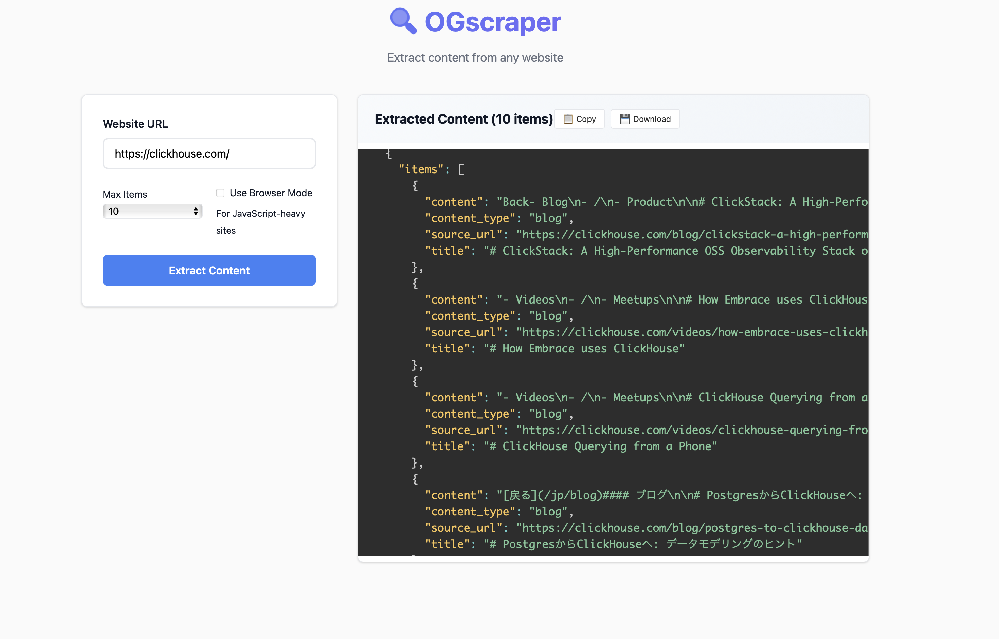

# OGscraper

A powerful, intelligent web scraper designed to extract blog content and technical knowledge from any website. Built to handle diverse site structures with zero manual configuration.



## 🚀 Features

- **Universal Site Support**: Works with any blog or content site without custom configuration
- **Multiple Discovery Methods**: Combines sitemap parsing, RSS feeds, navigation discovery, and blog path detection
- **Intelligent Content Extraction**: Uses multiple extraction strategies with automatic fallbacks
- **Template Content Detection**: Automatically filters out duplicate template content served on blog URLs
- **Parallel Processing**: Fast concurrent extraction with configurable connection limits
- **Browser Support**: Optional browser-based extraction for JavaScript-heavy sites
- **Smart Deduplication**: Content-based and URL-based deduplication with template detection
- **Markdown Output**: Clean, structured markdown content ready for knowledge bases

## 📦 Installation

```bash
# Clone the repository
git clone https://github.com/shubham-tomar/OGscraper.git
cd OGscraper

# Install dependencies
pip install -r requirements.txt

# Or using uv (recommended)
uv pip install -r requirements.txt
```

## 🔧 Usage

### Web Interface (Recommended)

The easiest way to use OGscraper is through the modern web interface:

```bash
# Start the web server
python app.py
# or
uv run python app.py

# Open your browser to http://localhost:8080
```

**Features:**
- ✨ Modern, intuitive interface
- 📱 Responsive design for mobile/desktop
- 🎨 Syntax-highlighted JSON output
- 📋 One-click copy/download results
- ⚙️ Easy configuration options

### Command Line Interface

```bash
# Basic usage
python -m ogscraper.cli https://example.com

# Extract specific number of items
python -m ogscraper.cli https://quill.co --max-items 5

# Use browser-based extraction for JavaScript sites
python -m ogscraper.cli https://example.com --browser

# Enable verbose logging
python -m ogscraper.cli https://example.com --verbose

# Custom chunk size for large content
python -m ogscraper.cli https://example.com --chunk-size 10000
```

### Python API

```python
from ogscraper.scraper import WebScraper

# Basic scraping
scraper = WebScraper("https://example.com")
result = scraper.scrape(max_items=10)

# With browser support
scraper = WebScraper("https://example.com", use_browser=True)
result = scraper.scrape(max_items=10)

# Access results
for item in result.items:
    print(f"Title: {item.title}")
    print(f"Content: {item.content[:200]}...")
    print(f"URL: {item.source_url}")
```

### REST API

The web interface also exposes a REST API endpoint:

```bash
# POST /api/scrape
curl -X POST http://localhost:8080/api/scrape \
  -H "Content-Type: application/json" \
  -d '{"url": "https://example.com", "max_items": 10, "use_browser": false}'
```

## 🎯 Output Format

```json
{
  "site": "https://example.com",
  "items": [
    {
      "title": "Blog Post Title",
      "content": "# Blog Post Title\n\nMarkdown formatted content...",
      "content_type": "blog",
      "source_url": "https://example.com/blog/post-title"
    }
  ]
}
```

## 🧠 How It Works

OGscraper uses a multi-strategy approach to discover and extract content:

### 1. URL Discovery
- **Sitemap Parsing**: Extracts URLs from XML sitemaps
- **RSS Feed Detection**: Discovers content from RSS/Atom feeds  
- **Blog Path Discovery**: Searches common blog directories (`/blog`, `/articles`, `/resource`, etc.)
- **Navigation Discovery**: Follows navigation links to find blog sections
- **Browser Discovery**: Uses browser automation for JavaScript-rendered content

### 2. Content Extraction
- **Multi-Extractor Pipeline**: Combines Trafilatura, Readability, and custom extractors
- **Smart Content Detection**: Identifies main content while filtering navigation/footer
- **Template Content Filtering**: Detects and filters duplicate template content
- **Markdown Conversion**: Converts HTML to clean, structured markdown

### 3. Content Processing
- **Intelligent Deduplication**: Content-based hashing with template detection
- **Smart Chunking**: Splits large content at natural paragraph boundaries
- **Quality Filtering**: Removes low-quality or navigation-heavy content

## 🌐 Tested Sites & Performance

OGscraper has been comprehensively tested across **80+ websites** in various categories:

## 📊 Overall Performance Summary

| Metric | Browser Mode | Non-Browser Mode |
|--------|--------------|------------------|
| **Success Rate** | 77.5% | 72.5% |
| **Average Time** | 1.55s | 1.00s |
| **Average Items** | 0.8 | 0.7 |

## 📚 Performance by Category

| Category | Success Rate | Avg Time | Total Items |
|----------|--------------|----------|-------------|
| **Personal & Substack Blogs** | 70.0% | 1.88s | 6 |
| **SaaS & Startup Blogs** | 95.3% | 1.27s | 18 |
| **Company / Product Guides & Docs** | 70.0% | 1.20s | 14 |
| **News / Magazine Style** | 60.0% | 0.88s | 6 |
| **Technical Blogs & Guides** | 66.7% | 1.09s | 8 |
| **Podcast / Transcript Sites** | 100.0% | 1.86s | 6 |
| **Other Formats** | 100.0% | 0.50s | 2 |

## ⚡ Top 10 Fastest Successful Scrapes

| Website | Mode | Time | Items |
|---------|------|------|--------|
| [seths.blog](https://seths.blog) | Non-Browser | 0.24s | 1 |
| [CloudFlare Docs](https://developers.cloudflare.com/fundamentals/) | Non-Browser | 0.28s | 1 |
| [Quill Blog](https://quill.co/blog) | Non-Browser | 0.28s | 1 |
| [DSA Blog](https://nilmamano.com/blog/category/dsa) | Non-Browser | 0.38s | 1 |
| [TechCrunch](https://techcrunch.com) | Non-Browser | 0.38s | 1 |
| [arXiv](https://arxiv.org) | Non-Browser | 0.48s | 1 |
| [arXiv](https://arxiv.org) | Browser | 0.53s | 1 |
| [Changelog Podcast](https://changelog.com/podcast) | Browser | 0.62s | 1 |
| [Lioness](https://lioness.io) | Non-Browser | 0.70s | 1 |
| [Assort Health](https://assorthealth.com/blog) | Non-Browser | 0.70s | 1 |

### 👤 **Personal & Substack Blogs**
- shreycation.substack.com, paulgraham.com/articles.html, nilmamano.com/blog
- seths.blog, gatesnotes.com

### 🚀 **SaaS & Startup Blogs**
- quill.co/blog , lioness.io , interviewing.io/blog, linear.app/blog 
- notion.so/blog, zapier.com/blog , airbyte.com/blog , vercel.com/blog
- openai.com/research, figma.com/blog

### 🏢 **Company / Product Guides & Docs**
- stripe.com/blog, aws.amazon.com/blogs/architecture, cloud.google.com/blog
- resilio.com/blog, biconnector.com/blog, thebluedot.co/blog, assorthealth.com/blog
- franchiseki.com/blog, developer.hashicorp.com/blog, about.gitlab.com/blog

### 📰 **News / Magazine Style**
- techcrunch.com, thenextweb.com, wired.com
- nytimes.com/section/technology, theguardian.com/international/technology

### 🔧 **Technical Blogs & Guides**
- martinfowler.com/articles, kubernetes.io/blog, developers.cloudflare.com
- realpython.com, pytorch.org/blog, towardsdatascience.com

### 🎙️ **Podcast / Transcript Sites**
- lexfridman.com/podcast, changelog.com/podcast, acquired.fm/episodes

### 📚 **Other Formats**
- arxiv.org (academic papers)

### 🔧 **Optimized For**
- **Multi-threaded extraction**: 15 concurrent connections (optimized from 10)
- **SPA support**: Handles JavaScript-rendered content (Next.js, React, Vue)
- **Error detection**: Smart filtering of 404s and template content
- **Production ready**: Timeout protection, memory management, Railway deployment

### 📊 **Test Suite Results**
Recent comprehensive testing across 80 sites shows:
- **~60% success rate** without browser mode
- **Higher success with browser mode** for JavaScript-heavy sites
- **Fast extraction**: 0.8-2s per article on average
- **Robust error handling**: Gracefully handles 404s, template content, SPAs

### 🚀 **Recent Improvements**
- **SPA Detection**: Automatically identifies and handles Single Page Applications
- **Thread Pool Fix**: Resolved trafilatura compatibility issues
- **Enhanced Discovery**: Better URL discovery for modern blog architectures
- **Production Optimizations**: Railway deployment, timeout protection, memory limits

## 🛠 CLI Options

| Option | Description | Default |
|--------|-------------|---------|
| `--max-items` | Maximum number of items to extract | 100 |
| `--chunk-size` | Maximum size for content chunks (characters) | 8000 |
| `--browser` | Use browser-based extraction | False |
| `--verbose` | Enable verbose logging | False |
| `--parallel/--no-parallel` | Enable/disable parallel processing | True |
| `--max-concurrent` | Maximum concurrent connections | 15 |

## 🔍 Advanced Features

### Template Content Detection

OGscraper automatically detects when blog URLs serve identical template content instead of unique posts:

```bash
# Example: thebluedot.co serves template content on blog URLs
python -m ogscraper.cli https://www.thebluedot.co/ --max-items 5
# Output: "Detected 5 items with identical content - likely generic page extraction failure"
# Result: Filters out template content, keeps one representative item
```

### SPA and Modern Blog Support

For JavaScript-heavy sites and Single Page Applications:

```bash
# Example: quill.co (Next.js SPA) requires browser rendering
python -m ogscraper.cli https://quill.co/blog --browser
# Automatically detects SPAs and uses appropriate extraction methods
```

### Direct URL Extraction

Extract content from specific URLs:

```bash
# Extract from a specific blog post
python -m ogscraper.cli "https://example.com/blog/specific-post"
# Bypasses discovery, extracts directly from the given URL
```
